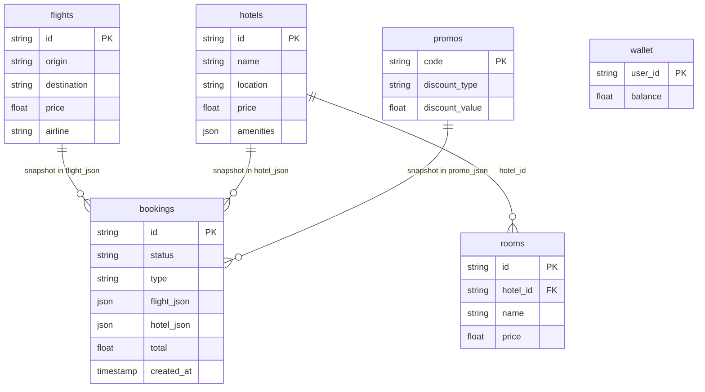

# Relational Database Design & Modeling — 3-backend-app

This document describes the **PostgreSQL** relational schema used by the booking backend: entities, relationships, and design decisions.

---

## 1. Entity-Relationship Overview

```
┌─────────────┐       ┌─────────────┐
│   flights   │       │   hotels    │
│ (catalog)   │       │ (catalog)   │
└──────┬──────┘       └──────┬──────┘
       │                      │
       │                      │ 1:N
       │                      ▼
       │               ┌─────────────┐
       │               │   rooms     │
       │               │ hotel_id FK │
       │               └─────────────┘
       │                      │
       │  (snapshot in JSON)  │
       └──────────┬───────────┘
                  ▼
           ┌─────────────┐      ┌─────────────┐
           │  bookings   │      │   wallet    │
           │ flight_json │      │ user_id PK  │
           │ hotel_json  │      └─────────────┘
           └──────┬──────┘
                  │
           ┌──────┴──────┐
           │   promos    │  (referenced by code in booking snapshot)
           │ code PK     │
           └─────────────┘
```

---

## 2. Tables and Columns

### 2.1 `flights` (flight catalog)

| Column           | Type    | Nullable | Key  | Description                    |
|------------------|---------|----------|------|---------------------------------|
| id               | VARCHAR | NO       | PK   | Unique flight id (e.g. f1)     |
| origin           | VARCHAR | NO       | IDX  | IATA origin code (e.g. DEL)    |
| origin_city      | VARCHAR | NO       |      | Display name                   |
| destination      | VARCHAR | NO       | IDX  | IATA destination code          |
| destination_city | VARCHAR | NO       |      | Display name                   |
| departure_time   | VARCHAR | NO       |      | ISO datetime string            |
| arrival_time     | VARCHAR | NO       |      | ISO datetime string            |
| price            | FLOAT   | NO       |      | Base price                     |
| airline          | VARCHAR | NO       |      | Airline name                   |
| duration         | VARCHAR | YES      |      | e.g. "2h 30m"                  |

- **Purpose:** Searchable flight catalog (seed data). No FK from other tables; bookings store a **snapshot** in JSON.

---

### 2.2 `hotels` (hotel catalog)

| Column    | Type    | Nullable | Key  | Description        |
|-----------|---------|----------|------|--------------------|
| id        | VARCHAR | NO       | PK   | Unique hotel id    |
| name      | VARCHAR | NO       |      | Hotel name         |
| location  | VARCHAR | NO       | IDX  | City/region        |
| address   | VARCHAR | YES      |      | Full address       |
| lat       | FLOAT   | YES      |      | Latitude           |
| lng       | FLOAT   | YES      |      | Longitude          |
| price     | FLOAT   | NO       |      | Default/lead price |
| rating    | FLOAT   | YES      |      | e.g. 4.8           |
| image     | VARCHAR | YES      |      | Image path/URL     |
| amenities | JSON    | YES      |      | Array of strings   |

- **Purpose:** Searchable hotel catalog. Related **rooms** linked by `hotel_id` (1:N).

---

### 2.3 `rooms`

| Column    | Type    | Nullable | Key  | Description     |
|-----------|---------|----------|------|-----------------|
| id        | VARCHAR | NO       | PK   | Unique room id  |
| hotel_id  | VARCHAR | NO       | FK   | → hotels.id     |
| name      | VARCHAR | NO       |      | Room type name  |
| price     | FLOAT   | NO       |      | Room price      |
| max_guests | INT    | YES      |      | Capacity        |

- **Relationship:** Many-to-one with `hotels`. Cascade delete: deleting a hotel removes its rooms.
- **Purpose:** Hotel inventory; user picks a room when booking. Booking stores a **snapshot** of the chosen hotel/room in JSON.

---

### 2.4 `bookings`

| Column             | Type    | Nullable | Key  | Description                          |
|--------------------|---------|----------|------|--------------------------------------|
| id                 | VARCHAR | NO       | PK   | Booking reference (e.g. BKxxxxxxxx)  |
| status             | VARCHAR | NO       |      | confirmed, cancelled                 |
| type               | VARCHAR | NO       |      | flight, hotel, bundle                |
| flight_json        | JSON    | YES      |      | Snapshot of flight at booking time   |
| hotel_json         | JSON    | YES      |      | Snapshot of hotel/room at booking    |
| total              | FLOAT   | YES      |      | Final amount                         |
| promo_json         | JSON    | YES      |      | Applied promo snapshot               |
| insurance          | BOOLEAN | YES      |      | Travel insurance added               |
| use_wallet         | BOOLEAN | YES      |      | Wallet used                          |
| wallet_deduction   | FLOAT   | YES      |      | Amount deducted from wallet         |
| card_number        | VARCHAR | YES      |      | Masked/last4 (mock payment)         |
| expiry             | VARCHAR | YES      |      | Card expiry (mock)                   |
| refund_status      | VARCHAR | YES      |      | e.g. initiated                        |
| refund_initiated_at| TIMESTAMP | YES    |      | When refund was requested            |
| created_at         | TIMESTAMP | YES    |      | Booking creation time                |

- **Design choice — JSON snapshots:**  
  `flight_json` and `hotel_json` store the **state of the offer at booking time**. This avoids strong FKs to `flights` / `hotels` / `rooms`, so:
  - Catalog can change (prices, names) without touching historical bookings.
  - Supports bundle and custom/edited offers.
  - Trade-off: reporting by flight/hotel requires JSON queries or application-level joins; no DB-level referential integrity from booking to catalog.

- **User ownership:**  
  Currently there is **no `user_id`** on `bookings`; the API returns all bookings. When auth is introduced, add `user_id` (FK to `users`) and scope queries by it.

---

### 2.5 `wallet`

| Column   | Type  | Nullable | Key  | Description     |
|----------|-------|----------|------|-----------------|
| user_id  | VARCHAR | NO     | PK   | User identifier |
| balance  | FLOAT | NO       |      | Current balance |

- **Purpose:** One row per user (e.g. `user_id = "default"`). Used at checkout for credits; no separate `users` table yet.

---

### 2.6 `promos`

| Column         | Type    | Nullable | Key  | Description              |
|----------------|---------|----------|------|--------------------------|
| code           | VARCHAR | NO       | PK   | Promo code (e.g. SAVE10) |
| discount_type  | VARCHAR | NO       |      | percent \| fixed         |
| discount_value | FLOAT   | NO       |      | % or fixed amount       |
| max_discount   | FLOAT   | YES      |      | Cap for percent          |

- **Purpose:** Lookup by code at checkout; applied discount is stored as `promo_json` on the booking (snapshot).

---

## 3. Relationships Summary

| From      | To       | Cardinality | How |
|-----------|----------|-------------|-----|
| hotels    | rooms    | 1:N         | FK rooms.hotel_id → hotels.id, cascade delete |
| bookings  | flights  | logical only | Snapshot in flight_json (no FK) |
| bookings  | hotels   | logical only | Snapshot in hotel_json (no FK) |
| bookings  | promos   | logical only | Snapshot in promo_json (no FK) |
| wallet    | (user)   | 1:1 per user | user_id as PK; no users table yet |

---

## 4. Indexes (current)

- **flights:** PK on `id`, index on `origin`, `destination` (for search).
- **hotels:** PK on `id`, index on `location`.
- **rooms:** PK on `id`, FK on `hotel_id`.
- **bookings:** PK on `id`; consider index on `created_at` (and `user_id` when added) for listing/sorting.
- **wallet:** PK on `user_id`.
- **promos:** PK on `code`.

---

## 5. Design Decisions

| Decision | Rationale |
|----------|-----------|
| **Booking snapshot (JSON)** | Preserves offer at booking time; catalog can evolve; supports bundles and future flexibility. |
| **No FKs from booking to flight/hotel** | Avoids coupling to catalog lifecycle; simplifies schema. Analytics can use JSON fields or a separate reporting model. |
| **No `users` table yet** | Auth is mock; wallet and preferences use a single `user_id` ("default"). Add `users` when introducing real auth. |
| **Wallet per user_id** | Single row per user; simple balance and top-up/use. |
| **Promo as lookup table** | Validate at checkout; store result in booking for history. |

---

## 6. Optional Future Normalization

If you need **strong links** from bookings to catalog for reporting or integrity:

1. **Add `users` table** and `bookings.user_id` FK; scope all booking reads/writes by user.
2. **Optional:** Add `bookings.flight_id` (FK → flights.id) and/or `bookings.hotel_id` (FK → hotels.id) as **optional** fields, populated when the booked item matches a catalog row. Keep `flight_json` / `hotel_json` for display and history; use FKs for analytics and joins.
3. **Indexes:** `bookings(user_id, created_at)`, and if added, `bookings(flight_id)`, `bookings(hotel_id)`.

---

## 7. Mermaid ER (for diagrams)



---

## 8. References

- **ORM:** `app/models.py` (SQLAlchemy)
- **Migrations:** Alembic (configure as needed)
- **Seed:** `app/db/seed.py`
- **API contracts:** `API_CONTRACTS.md`
